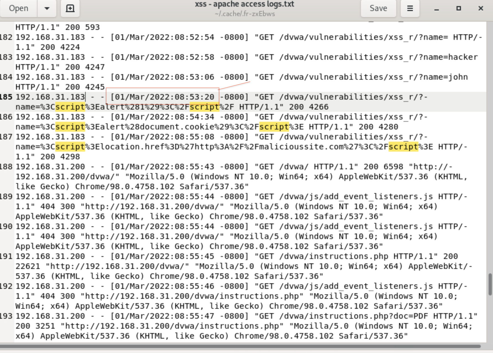
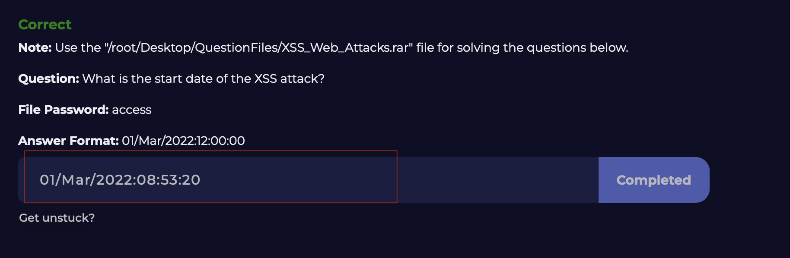
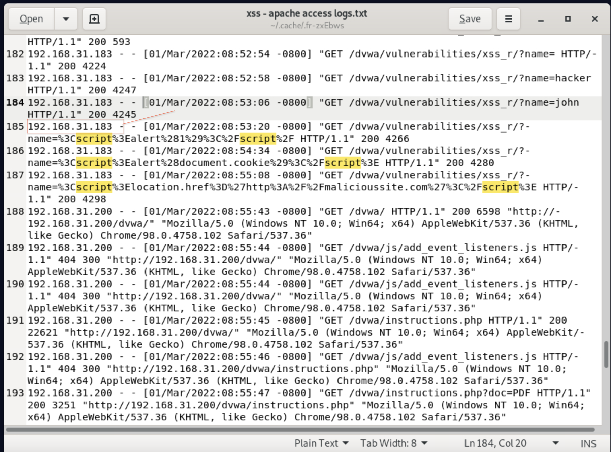
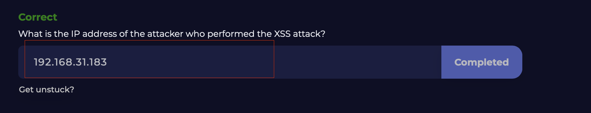
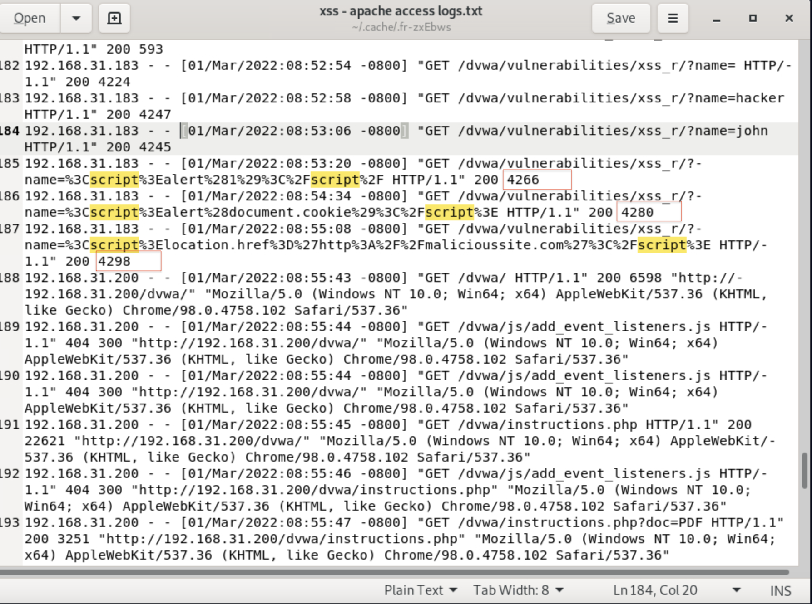
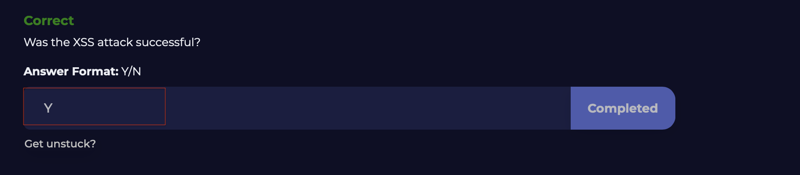
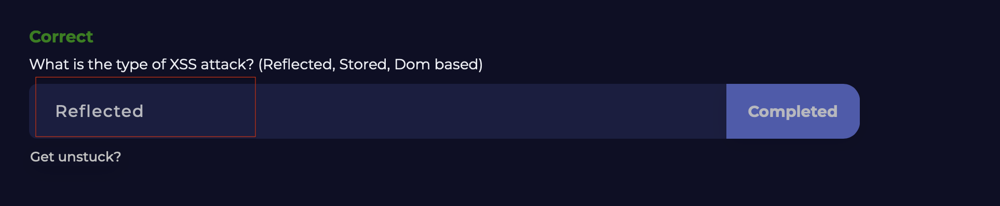

# Detecting-Cross-Site-Scripting-XSS-Attacks

I completed the Cross-Site Scripting (XSS) Lab on LetsDefend . Here’s what I explored:

✅ What XSS is: Understanding the nature of Cross-Site Scripting attacks.

✅ Types of XSS: Including Reflected XSS (Non-Persistent), Stored XSS (Persistent), and DOM-Based XSS.

✅ How XSS works: Gained an understanding of how XSS vulnerabilities are exploited.

✅ What attackers can do with XSS: Such as stealing user session information and capturing credentials.

✅ Different ways to prevent XSS: Techniques such as sanitizing user data, using the framework correctly, and keeping the framework up-to-date.

✅ How to detect XSS attacks: Methods for identifying XSS, including looking for special keywords (e.g., script, alert), checking for commonly used payloads, and looking for special characters like < and > in user input.

## Finding the Answer to Question 1

## Question 1 Correct Answer

## Finding the Answer to Question 2

## Question 2 Correct Answer

## Finding the Answer to Question 3

## Question 3 Correct Answer

## Question 4 Correct Answer

